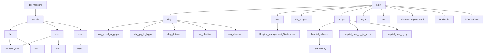

# Hospital Management

## Description
This repository is an ELT (Extract, Load, Transform) data pipeline design to process and analyze hospital management system data from Kaggle. The pipeline works by ingesting raw hospital data from an Excel file and transform it into multiple metrics for analytics. 

Stack used for this project are:
1. Airflow -> for orchestration and job scheduling
2. Docker -> for containerization
3. Python -> for scripting data ingestion and loading
4. PostgreSQL -> for the staging data warehouse
5. BigQuery -> for the analytics data warehouse
6. dbt -> for data modeling and transformation
7. Looker Studio -> for visualization and analysis


## Objective
- Build a complete end to end ELT pipeline from raw data ingestion to ready for analysis
- Orchestrate pipeline processes using Airflow
- Containerization using Docker to ensure the environment runs well in another machine
- Transform and modelling the data using dbt and also providing the backfill capability to fill the data from certain period of time
- Provide a solid ground for hospital performance analysis using Looker Studio

## Folder Structure
### Graph TD

### Tree
```
root
├── dags/
│ ├── dag_excel_to_pg.py
│ ├── dag_pg_to_bq.py
│ ├── dag_dbt-fact...
│ ├── dag_dbt-dim...
│ ├── dag_dbt-mart...
├── data/
│ ├── Hospital Management System.xlsx
├── dbt_hospital/
│ └── models/
│  ├── fact/
│  │ ├── sources.yaml
│  │ ├── fact_appointments.sql
│  │ ├── fact_bed_records.sql
│  │ ├── fact_medical_records.sql
│  │ ├── fact_room_records.sql
│  │ └── fact_surgery_records.sql
│  ├── dim/
│  │ ├── sources.yaml
│  │ ├── dim_beds.sql
│  │ ├── dim_departments.sql
│  │ ├── dim_doctors.sql
│  │ ├── dim_helpers.sql
│  │ ├── dim_nurses.sql
│  │ ├── dim_patients.sql
│  │ ├── dim_rooms.sql
│  │ ├── dim_staff_shifts.sql
│  │ └── dim_wards.sql
│  └── mart/
|    ├── mart_appointments_count.sql
|    ├── mart_appointments_rate.sql
|    ├── mart_bed_avg_occupancy_rate.sql
│    └── mart_surgery_count.sql
├── scripts/
| ├── hospital_schema/
| | └── ...schema.py
│ ├── hospital_data_pg_to_bq.py
│ └── hospital_data_pg.py
├── keys
├── .env
├── docker-compose.yaml
├── Dockerfile
└── README.md
```

## How to Execute the setup Docker
1. Make sure to put the service account key in the `/keys` folder since it is not included in the repository
2. Run `docker-compose build` to build the necessary components and dependencies
3. Run `docker-compose up` to turn on all of the services
4. Run `docker-compose ps -a` to check the status of each of the service
5. Once the airflow-webservice is up, go to http://localhost:8080/ to open Apache Airflow

## How to Execute the Pipelines
1. Execute `dag_excel_to_pg` in Airflow to extract the hospital data from the Excel file and ingest it to Postgres into seperate tables
2. Execute `dag_pg_to_bq` in Airflow to extract hospital data tables from Postgres and ingest them to BigQuery: `purwadika.jcdeol3_final_project_hafizh`

## How to connect to the Postgres Database
1. Open DBeaver (or any other SQL database management tool)
2. In the tool bar, choose Database -> New Database Connection
3. In the connection menu, choose PostgreSQL as the database then click next
4. Fill in:\
-- Host: localhost\
-- Database: hospital-db\
-- Port: 5433\
-- Username: hospital-db\
-- Password: hafizh\
Then test the connection. If connected, press OK

## How to Execute the Transformation using dbt
1. Execute `dag_dbt-dim_beds` in Airflow to create a dim table containing beds data. 
2. Execute `dag_dbt-dim_departments` in Airflow to create a dim table containing departments data. 
3. Execute `dag_dbt-dim_doctors` in Airflow to create a dim table containing doctors data. 
4. Execute `dag_dbt-dim_nurses` in Airflow to create a dim table containing nurses data. 
5. Execute `dag_dbt-dim_patients` in Airflow to create a dim table containing patients data. 
6. Execute `dag_dbt-dim_rooms` in Airflow to create a dim table containing rooms data. 
7. Execute `dag_dbt-dim_staff_shifts` in Airflow to create a dim table containing staff shifts data. 
8. Execute `dag_dbt-dim_wards` in Airflow to create a dim table containing wards data. 
10. Execute `dag_dbt-fact_appointments` in Airflow to create a fact table containing appointments data. For full-refresh, execute `dag_dbt-fact_appointments-full_refresh`. For backfill, execute `dbt-fact_appointments-backfill`
11. Execute `dag_dbt-bed_records` in Airflow to create a fact table containing bed records data. For full-refresh, execute `dag_dbt-bed_records-full_refresh`. For backfill, execute `dbt-bed_records-backfill`
12. Execute `dag_dbt-medical_records` in Airflow to create a fact table containing medical records data. For full-refresh, execute `dag_dbt-medical_records-full_refresh`. For backfill, execute `dbt-medical_records-backfill`
13. Execute `dag_dbt-room_records` in Airflow to create a fact table containing room records data. For full-refresh, execute `dag_dbt-room_records-full_refresh`. For backfill, execute `dbt-room_records-backfill`
14. Execute `dag_dbt-surgery_records` in Airflow to create a fact table containing surgery records data. For full-refresh, execute `dag_dbt-surgery_records-full_refresh`. For backfill, execute `dbt-surgery_records-backfill`
15. Execute `dag_dbt-mart_appointments_count` in Airflow to create a mart table containing appointments metric.
16. Execute `dag_dbt-mart_appointments_rate` in Airflow to create a mart table containing appointments metric.
17. Execute `dag_dbt-mart_bed_avg_occupancy_interval` in Airflow to create a mart table containing average bed occupancy interval metric.
18. Execute `dag_dbt-mart_surgery_count` in Airflow to create a mart table containing surgery metric.

## How to access Looker Studio
Go to this link for the visualization analysis: [Looker Studio](https://lookerstudio.google.com/u/0/reporting/b7398684-0454-47cd-ac18-b52ab59a0ccf/page/jJkRF) 

Other links:
- Kaggle dataset: https://www.kaggle.com/datasets/mshamoonbutt/hospital-management-system/data?select=Hospital+Management+System.xlsx
- BigQuery Dataset: purwadika.jcdeol3_final_project_hafizh