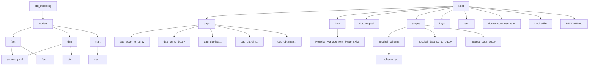

# Hospital Management

## Description
This repository is 

The entire solution is containerized using Docker, ensuring a portable setup.

## Objective
- blblbl

## Folder Structure
### Graph TD

### Tree
```
root
├── dags/
│ ├── dag_excel_to_pg.py
│ ├── dag_pg_to_bq.py
│ ├── dag_dbt-fact...
│ ├── dag_dbt-dim...
│ ├── dag_dbt-mart...
├── data/
│ ├── Hospital Management System.xlsx
├── dbt_hospital/
│ └── models/
│  ├── fact/
│  │ ├── sources.yaml
│  │ ├── fact_appointments.sql
│  │ ├── fact_bed_records.sql
│  │ ├── fact_medical_records.sql
│  │ ├── fact_room_records.sql
│  │ └── fact_surgery_records.sql
│  ├── dim/
│  │ ├── sources.yaml
│  │ ├── dim_beds.sql
│  │ ├── dim_departments.sql
│  │ ├── dim_doctors.sql
│  │ ├── dim_helpers.sql
│  │ ├── dim_nurses.sql
│  │ ├── dim_patients.sql
│  │ ├── dim_rooms.sql
│  │ ├── dim_staff_shifts.sql
│  │ └── dim_wards.sql
│  └── mart/
|    ├── mart_appointments_count.sql
|    ├── mart_appointments_rate.sql
|    ├── mart_bed_avg_occupancy_rate.sql
│    └── mart_surgery_count.sql
├── scripts/
| ├── hospital_schema/
| | └── ...schema.py
│ ├── hospital_data_pg_to_bq.py
│ └── hospital_data_pg.py
├── keys
├── .env
├── docker-compose.yaml
├── Dockerfile
└── README.md
```

## How to Execute the setup Docker
1. Make sure to put the service account key in the `/keys` folder since it is not included in the repository
2. Run `docker-compose build` to build the necessary components and dependencies
3. Run `docker-compose up` to turn on all of the services
4. Run `docker-compose ps -a` to check the status of each of the service
5. Once the airflow-webservice is up, go to http://localhost:8080/ to open Apache Airflow

## How to Execute the Pipelines
1. Execute `dag_excel_to_pg` in Airflow to extract the hospital data from the Excel file and ingest it to Postgres into seperate tables
2. Execute `dag_pg_to_bq` in Airflow to extract hospital data tables from Postgres and ingest them to BigQuery: `purwadika.jcdeol3_final_project_hafizh`

## How to Execute the Transformation using dbt
1.


Links: